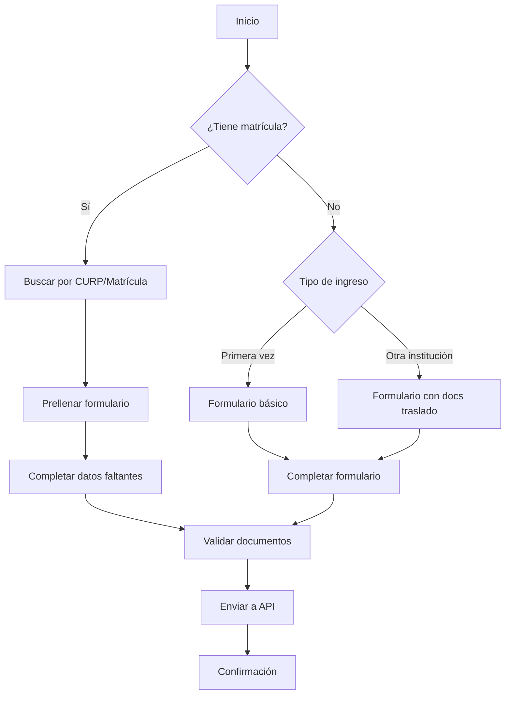

# SEA - Sistema de Enseñanza Abierta (COBACH)

Un sistema web moderno y eficiente para el registro y gestión de expedientes de alumnos del Colegio de Bachilleres de Chiapas. Desarrollado con **Angular CLI 19** y **FastAPI**, permite a los estudiantes completar su registro de manera intuitiva, evitando campos innecesarios según su tipo de ingreso.

> Desarrollado por César Sánchez ([@baip49](https://github.com/baip49) en GitHub)

## 🎯 Propósito del Proyecto

El sistema SEA facilita el proceso de registro de alumnos mediante un formulario inteligente que:
- **Adapta los campos** según el tipo de ingreso del estudiante
- **Valida automáticamente** documentos requeridos específicos
- **Evita duplicación** de información para alumnos con matrícula existente
- **Optimiza el tiempo** de registro y reduce errores humanos

## 🏗️ Arquitectura y Tecnologías

### Frontend
- **Angular CLI 19.0.2** con TypeScript (recomendación de Ing. Dani y Ing. Rigo)
- **Tailwind CSS** para diseño moderno e intuitivo (basado en pantallas de la Lic. Pao)
- **SweetAlert2** para notificaciones elegantes (recomendación de Ing. Rodolfo)
- **RxJS** para manejo reactivo de datos

### Backend
- **FastAPI** (Python) - API REST externa
- **Base de datos** con catálogos de localidades y lenguas indígenas

### ¿Por qué estas tecnologías?

**Angular CLI sobre JavaScript vanilla**: *"El uso de Angular CLI fue recomendación del Ing. Dani y el Ing. Rigo. Querían algo que no fuera JavaScript, así que utilizando Angular CLI se cambia a TypeScript."*

**Tailwind CSS sobre Bootstrap**: *"Utilicé tailwind al tratar de evitar que la aplicación se vea genérica con el uso de Bootstrap. Utilizando como base las pantallas de la Lic. Pao, pude, con tailwind, tener un diseño novedoso, atractivo e intuitivo para los alumnos."*

## 🚀 Instalación y Configuración

### Prerrequisitos
- Node.js (versión 18 o superior)
- Angular CLI 19
- API FastAPI corriendo en `http://127.0.0.1:8000` [seaapi](https://github.com/baip49/seaapi)

### Instalación

1. **Clonar el repositorio**
```bash
git clone https://github.com/baip49/seaform.git
cd seaform
```

2. **Instalar dependencias**
```bash
npm install
```

3. **Configurar la API**
Verificar que la URL base en `src/app/services/api/api.ts` apunte a tu servidor FastAPI:
```typescript
private baseUrl = 'http://127.0.0.1:8000';
```

4. **Ejecutar en desarrollo**
```bash
ng serve
```

El sistema estará disponible en `http://localhost:4200/`

## 📋 Funcionalidades Principales

### 🎓 Tipos de Ingreso (IdRol)

El sistema maneja tres tipos de estudiantes:

| IdRol | Tipo | Descripción | Documentos Adicionales |
|-------|------|-------------|------------------------|
| 1 | **Matrícula Existente** | Estudiantes ya registrados en COBACH | • Constancia de estudios |
| 2 | **Primera Vez** | Estudiantes de nuevo ingreso | Documentos base únicamente |
| 3 | **Otra Institución** | Estudiantes por traslado | • Formato de solicitud de traslado<br>• Certificado parcial de estudios<br>• Tira de materias/plan curricular |

### 📄 Gestión de Documentos

#### Documentos Base (Todos los tipos)
- CURP (18 caracteres, formato mexicano)
- Acta de nacimiento actualizada
- Certificado de secundaria

#### Validaciones de Documentos
- **Formato**: Solo archivos PDF
- **Carga dinámica**: Según tipo de ingreso
- **Validación en tiempo real**: Barra de progreso visual
- **Gestión de existentes**: Manejo de documentos ya subidos

## 🧩 Arquitectura de Componentes

### 📱 Componentes Principales

#### **FormComponent** (`src/app/form/form.component.ts`)
Componente principal del formulario con funcionalidades avanzadas:

**Métodos principales:**
- `configurarDocumentosRequeridos()`: Configura documentos según IdRol
- `onArchivoSeleccionado(evento, documento)`: Valida y gestiona carga de PDFs
- `llenarFormulario(datos)`: Mapea datos para edición de alumnos existentes
- `procesarDocumentosExistentes(datos)`: Maneja documentos ya subidos
- `submit()`: Envía formulario con validaciones completas

**Características técnicas:**
- **Debouncing**: Búsquedas optimizadas con 500ms de delay
- **Validación reactiva**: FormGroup con validadores dinámicos
- **Mapeo inteligente**: Conversión automática de tipos de datos
- **Gestión de archivos**: Manejo simultáneo de archivos nuevos y existentes

#### **ApiService** (`src/app/services/api/api.ts`)
Servicio para comunicación con FastAPI:

**Endpoints principales:**
- `GET /alumnos/buscar/{criterio}`: Búsqueda de alumnos por CURP/matrícula
- `POST /alumnos`: Crear nuevo alumno con documentos
- `PUT /alumnos/{id}`: Actualizar alumno existente
- `GET /lenguas/search/{termino}`: Búsqueda de lenguas indígenas
- `GET /localidades/search/{termino}`: Búsqueda de localidades
- `GET /sangre`: Catálogo de tipos de sangre

**Características:**
- **Multipart forms**: Envío de archivos con FormData
- **Manejo de errores**: Respuestas HTTP estructuradas
- **Búsquedas optimizadas**: Queries con debouncing

### 🔄 Flujo de Usuario



## 📊 Validaciones y Lógica de Negocio

### Validaciones Automáticas
- **Edad**: Campos de tutor obligatorios para menores de 18 años
- **CURP**: Formato mexicano de 18 caracteres
- **Documentos**: Validación de PDFs y documentos requeridos
- **Campos condicionales**: Habilitación dinámica según respuestas

### Búsquedas Inteligentes
- **Lenguas indígenas**: Catálogo de base de datos (puede estar desactualizado)
- **Localidades**: Búsqueda por código postal y nombre
- **Debouncing**: 500ms para optimizar rendimiento

## 🗄️ Estructura de Datos

### Modelo de Alumno
```typescript
interface Alumno {
  id?: number;
  curp: string;           // 18 caracteres
  matricula?: string;
  nombre: string;
  apellidoPaterno: string;
  apellidoMaterno: string;
  fechaNacimiento: string;
  sexo: 'H' | 'M';
  telefono: string;
  correo: string;
  idSede: number;         // 1-4 (sedes COBACH)
  estadoCivil: 'S' | 'C' | 'D';
  idNacionalidad: number;
  hablaLengua: number;    // 0|1
  idLengua?: number;
  tieneBeca: number;      // 0|1
  queBeca?: string;
  hijoDeTrabjador: string;
  idRol: number;          // 1|2|3
  tieneAlergias: number;  // 0|1
  alergias?: string;
  tipoSangre: string;
  tieneDiscapacidad: number; // 0|1
  discapacidad?: string;
  // Datos de tutor (menores de edad)
  nombreTutor?: string;
  apellidoPaternoTutor?: string;
  apellidoMaternoTutor?: string;
  telefonoTutor?: string;
  // Dirección
  codigoPostal: string;
  calle: string;
  entreCalles?: string;
  numeroExterior: string;
  numeroInterior?: string;
  idLocalidad: number;
}
```

## 🚢 Despliegue

### Desarrollo (GitHub Pages)
```bash
ng build --configuration=production
# Automático via GitHub Actions
```

### Producción (Servidores COBACH)
```bash
ng build --configuration=production
# Despliegue manual en servidores institucionales
```

## 🧪 Testing

```bash
# Pruebas unitarias
ng test

# Pruebas e2e (pendiente configuración)
ng e2e
```

## 📝 Roadmap

### Funcionalidades Pendientes
- [ ] **Sistema de Login**: Pendiente definir fuente de credenciales
- [ ] **Administración**: Panel para gestión de usuarios
- [ ] **Reportes**: Generación de reportes estadísticos
- [ ] **Notificaciones**: Sistema de alertas por email

### Mejoras Técnicas
- [ ] **PWA**: Soporte offline
- [ ] **Internacionalización**: Soporte multi-idioma
- [ ] **Tests E2E**: Implementación de Cypress/Playwright

## 🤝 Contribución

### Estructura del Proyecto
```
src/
├── app/
│   ├── form/              # Componente principal del formulario
│   ├── home/              # Página de inicio y búsqueda
│   ├── list/              # Listado de alumnos
│   ├── header/            # Componente de navegación
│   ├── services/api/      # Servicio de comunicación con API
│   └── login/             # Login (pendiente implementación)
├── assets/                # Recursos estáticos
└── styles.css            # Estilos globales con Tailwind
```

### Comandos de Desarrollo
```bash
# Nuevo componente
ng generate component nombre-componente

# Nuevo servicio
ng generate service nombre-servicio


### Estándares de Código
- **TypeScript strict mode** habilitado
- **Prettier** para formateo de código
- **Convenciones Angular** para naming
- **Documentación JSDoc** para métodos complejos

## 📞 Soporte

Para reportar bugs o solicitar nuevas funcionalidades, contactar al equipo de desarrollo de COBACH Chiapas.

---

*Desarrollado con ❤️ para el Colegio de Bachilleres de Chiapas*